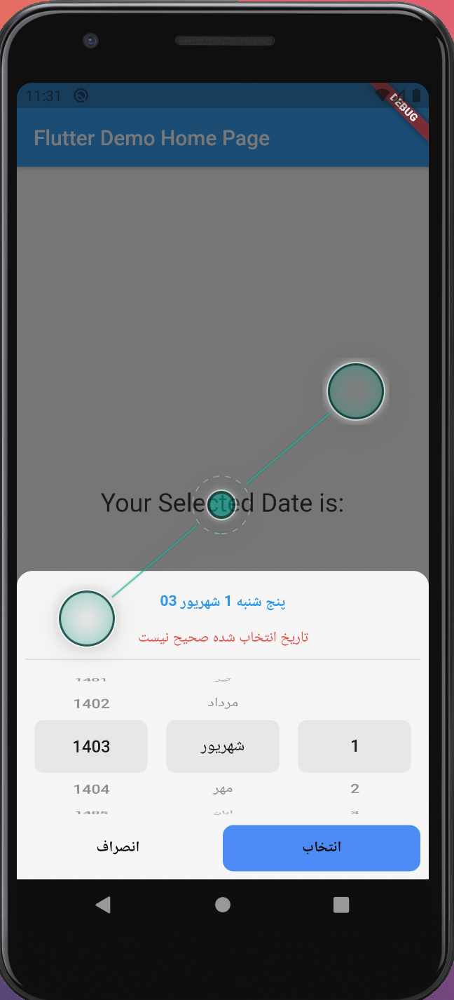

# shamsi_date_picker

ShamsiDatePicker is BottomModalSheet Jalali calendar which is used to select Jalali date.

- Jalali Date
- Set initial date
- Forward/backward selector
- Use custom validator for date




## Usage
```
await showPersianDatePicker(
      context,
      (context, Date date) async {
        setState(() {
          _selectedDate = date;
        });
        Navigator.of(context).pop();
      },
      forwardYear: true,
      border: BorderRadius.only(
          topRight: Radius.circular(15), topLeft: Radius.circular(15)),
      validate: (ctx, date) {
        return date.year < 1402;
      },
      submitButtonStyle: defaultButtonsStyle.copyWith(
        text: 'انتخاب',
        backgroundColor: Colors.blueAccent,
        radius: 10,
      ),
    );
```
## Parameters
`showPersianDatePicker(context, onSubmit, {/* ohter optional parameter*/});`

| Parameters |Type| Is Required  | Description |
| ----------- |----| ----------- | ----------- |
| context    | BuildContext | Yes ||
| onSubmit   | Future<void> Function(BuildContext context, Jalali date) | Yes |Callback function when a date is selected|
|initYear|int|No|Initial the **_Date Picker_** with optional date. Note that, this works when `initMonth` and `initDay` are provided.|
|initMonth|int|No|As the same as `initYear`|
|initDay|int|No|As the same as `initYear`|
|border|BorderRadiusGeometry|No|Optional BorderRadius|
|yearDirection|YearDirection|No|select year direction. Values are `YearDirection.backward`, `YearDirection.forward` and `YearDirection.both`|
|backgroundColor|Color|No||
|margin|EdgeInsets|No|Date Picker margin|
|submitButtonStyle|ButtonsStyle|No|Style of submit bottom|
|cancelButtonStyle|ButtonsStyle|No|Style of cancel bottom|
|validate|bool Function(BuildContext context, Jalali date)|No|You can provide a validate function to check if the selected date is correct or not|

#### The _ButtonsStyle_ class
| Parameters |Type| Is Required  | Description |
| ----------- |----| ----------- | ----------- |
|backgroundColor|Color|No|Default value is `Colors.white`|
|textColor|Color|No|Default value is `Colors.black`|
|radius|double|No|Default value is `5.0`|
|visible|bool|No|Default value is `true`|
|text|String|Yes|Default value is `''`|
## Getting Started

This project is a starting point for a Dart
[package](https://flutter.dev/developing-packages/),
a library module containing code that can be shared easily across
multiple Flutter or Dart projects.

For help getting started with Flutter, view our 
[online documentation](https://flutter.dev/docs), which offers tutorials, 
samples, guidance on mobile development, and a full API reference.
